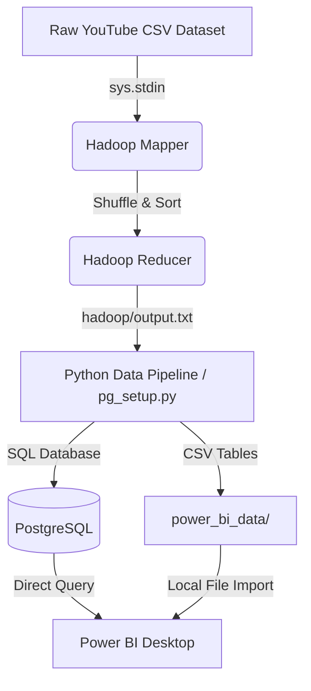

# 📊 YouTube Trending Analytics using Hadoop & Power BI

An end-to-end Big Data analytics project designed to process, aggregate, and visualize trending YouTube video statistics. This project employs a **Hadoop MapReduce** simulation (via Python Streaming) to handle large-scale video records, stores the aggregated results in a **PostgreSQL** database, and serves interactive business intelligence dashboards in **Power BI**.

---

## 🏗️ Architecture & Data Flow



1. **MapReduce Processing:** A large-scale CSV dataset containing trending YouTube videos is streamed through `mapper.py` and `reducer.py` to calculate engagement rates, region popularity, and global statistics.
2. **Database Pipeline:** The output results from the Reducer are parsed by a setup pipeline, which creates and seeds schemas in **PostgreSQL**.
3. **Power BI Visualization:** Processed data is exported into tabular formats and connected to Power BI to render clean, interactive visualizations.

---

## 🛠️ Technology Stack

* **Big Data Engine:** Hadoop MapReduce (Python Streaming API)
* **Programming Language:** Python 3.x
* **Database:** PostgreSQL
* **BI Visualizations:** Power BI Desktop
* **Scripting & Automation:** Windows Batch / PowerShell

---

## 📂 Project Structure

```text
├── backend/
│   └── requirements.txt      # Python library dependencies
├── database/
│   └── pg_setup.py           # Runs MapReduce simulation, seeds PostgreSQL & exports CSVs
├── hadoop/
│   ├── mapper.py             # MapReduce Mapper (extracts key columns)
│   ├── reducer.py            # MapReduce Reducer (aggregates metrics by region)
│   ├── run_local.bat         # Batch script to execute MapReduce pipeline locally
│   └── output.txt            # Generated outputs of MapReduce jobs
├── power_bi/
│   ├── Dashboard.pbix        # Pre-configured Power BI report template
│   └── README.md             # Custom guide on DAX metrics & visuals configuration
└── power_bi_data/            # Processed tables ready for Power BI import
    ├── global_stats.csv
    ├── region_popularity.csv
    └── trending_videos.csv
```

---

## 🚀 How to Run the Project

### 1. Prerequisites
Ensure you have the following installed on your system:
* Python 3.x (Anaconda or standalone)
* PostgreSQL Database Server (default credentials expected: `username: postgres`, `password: 1234`)
* Power BI Desktop

### 2. Install Dependencies
Open your terminal in the root directory of this repository and run:
```bash
pip install -r backend/requirements.txt
```

### 3. Run MapReduce & Setup Database
Execute the main database pipeline script. This will programmatically run the MapReduce Mapper and Reducer over the trending dataset, create the `youtube_trending` database tables in PostgreSQL, seed them, and export Power BI CSV tables:
```bash
python database/pg_setup.py
```

### 4. Build the Power BI Dashboard
* Open **Power BI Desktop**.
* Go to **Get Data** -> **Text/CSV** and select the three tables inside the `power_bi_data/` folder.
* Follow the step-by-step instructions in the [Power BI README Guide](power_bi/README.md) to set up KPI cards, Scatter plots, Donut charts, and dynamic Region filter slicers.

---

## 📊 Dashboard Visualizations

The Power BI Dashboard features three primary analytical views:
1. **Dashboard Home:** Quick view of total video metrics, total views, total engagements, average engagement rate, and region distribution bar charts.
2. **Market Analysis:** Scatter chart highlighting views-to-likes correlation, donut charts for regional shares, and a searchable/filterable video repository table.
3. **Region Intelligence:** Dropdown selector to dynamically view top video statistics and velocity metrics within a selected country.
